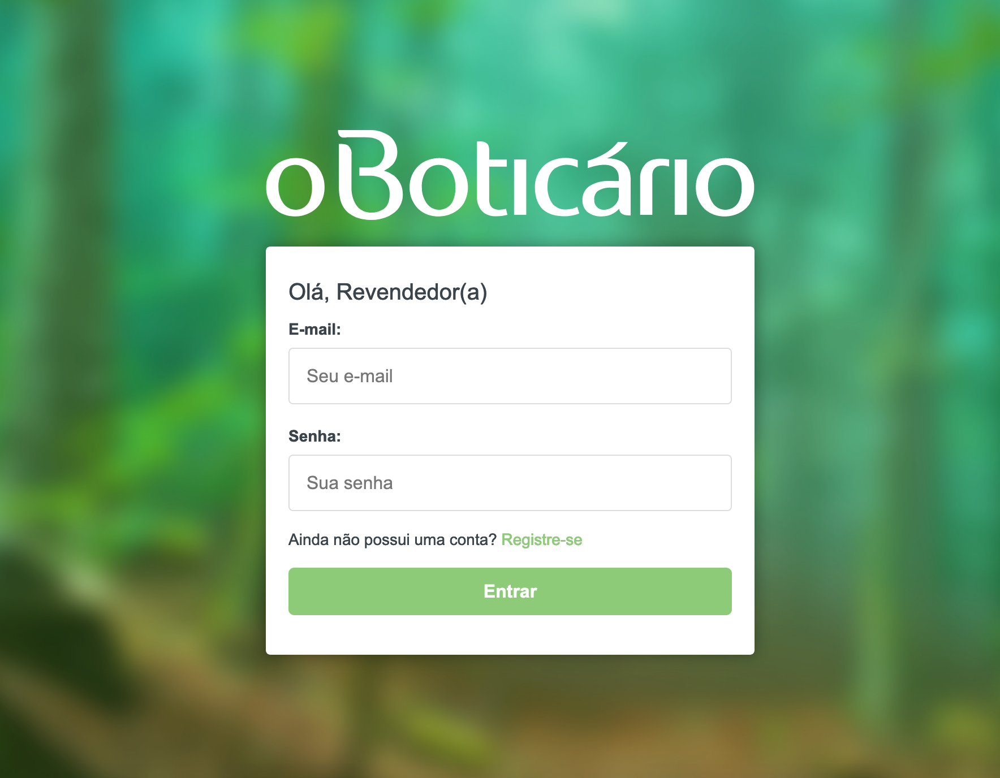
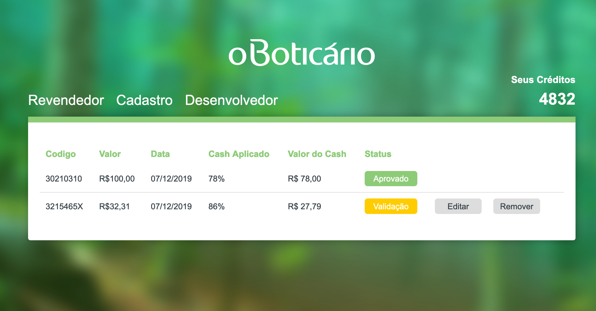
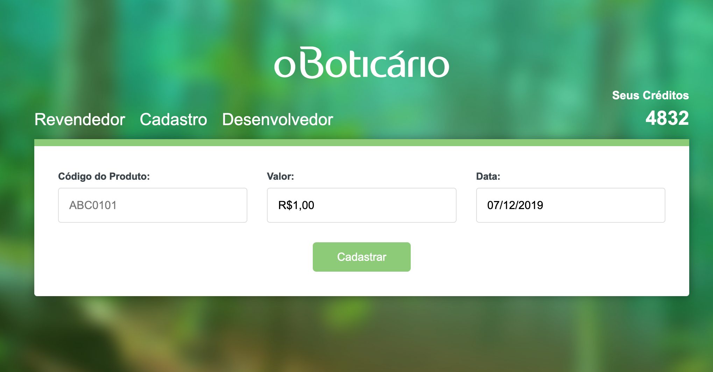
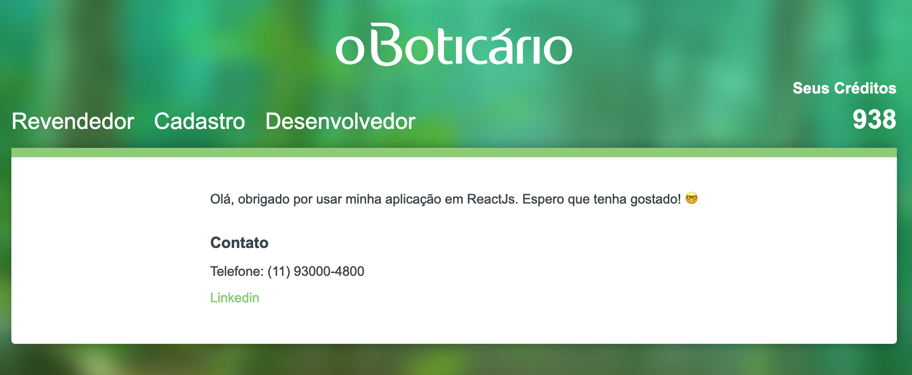

## Description
O projeto Front-end foi desenvolvido em ReactJS, faz consulta na API da Boticario para obter pontuação randômica conforme o CPF. Por ausência de Backend, decidi registrar todo o DATA da jornada do Revendedor via localStorage, aplicando desestruturação e outras técnicas para manipulação do Objeto JSON. 

## Features
- Tela de cadastro de um novo revendedor(a) solicitando Nome completo, CPF, e-mail e senha;
- Tela de login para informar e-mail e senha;
- Tela de cadastro de compras onde deverá ser informado o código, valor e data;
- Tela de listagem das compras cadastradas exibindo as informações de código da compra, valor, data, % de cashback aplicado, valor do cashback e status do cadastro;
- O status do cadastro poderá ser “Em validação”, “Reprovado” e “Aprovado;
- Opção para editar e excluir uma compra caso ele esteja“Em Validação;
- Tela para exibir o valor de cashback acumulado até o momento, esta informação virá de uma das APIs do boticário, que é um outro sistema que agrupa e consolida todas as vendas do revendedor(a);
- Tela de informações do sistema, nesta tela terá nome, e-mail e outros dados do desenvolvedor.

## Task List

- [x] Login;
	- [x] Informar e-mail e senha;;
- [x] SignIn;
	- [x] Nome completo, CPF, e-mail e senha;
- [x] Revendedor;
	- [x] Exibir o valor de cashback acumulado até o momento, esta informação virá de uma APIs do boticário;
	- [x] Listar Produtos com código da compra, valor, data, % de cashback aplicado, valor do cashback e status do cadastro
	- [x] O status do cadastro poderá ser “Em validação”, “Reprovado” e “Aprovado;
	- [x] Opção para editar e excluir uma compra caso ele esteja "Em Validação";
- [x] Cadastro;
	- [x] Deverá ser informado o código, valor e data (% de cashback e Status são Randômicos);
- [x] Desenvolvedor;
 	- [x] Nesta tela terá nome, e-mail e outros dados do desenvolvedor;

## Application

#### Links

> Wire installation is required for package management.

[Install Yarn](https://yarnpkg.com/lang/en/)

#### Dependences
`$ yarn install`

#### Run Application
`$ yarn dev`

## Screens

#### Login

#### SignIn

#### Revendedor (Listar Produtos)

#### Cadastro de Produtos

#### Desenvolvedor

